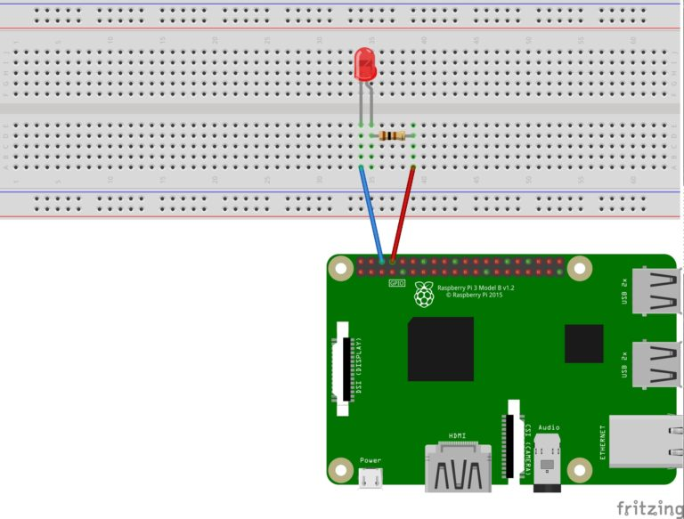

## Making a LED blink using the Raspberry Pi and Python

---

### Requirement

- Raspberry Pi
- Bread board
- Jumper wires for easy hookup
- Resistor pack
- Red LED (Any color you prefer)

---

### Setting up the circuit

#### The first step in this project is to design a simple LED circuit. Then we will make the LED circuit controllable from the Raspberry Pi by connecting the circuit to the general purpose input/output (GPIO) pins on the Raspberry Pi.

#### A simple LED circuit consists of a LED and resistor. The resistor is used to limit the current that is being drawn and is called a current limiting resistor. Without the resistor the LED would run at too high of a voltage, resulting in too much current being drawn which in turn would instantly burn the LED, and likely also the GPIO port on the Raspberry Pi.

#### To calculate the resistor value we need to examine the specifications of the LED. Specifically we need to find the forward voltage (VF) and the forward current (IF). A regular red LED has a forward voltage (VF) of 1.7V and forward current of 20mA (IF). Additionally we need to know the output voltage of the Raspberry Pi which is 3.3V.

#### We can then calculate the resistor size needed to limit the current to the LED’s maximum forward current (IF) using ohm’s law like this:


#### Unfortunately 80 ohm is not a standard size of a resistor. To solve this we can either combine multiple resistors, or round up to a standard size. In this case we would round up to 100 ohm.

---

### Circuit Image



### Rasberry Pi Board Image


## Next procedure

### Copy the repository

```
git clone https://github.com/Pankaj-SinghR/IOT-Programs-Assignment.git
```

### Change directory

```
cd LED-Blink
```

### Run the python file

```
python3 Blink_LED.py
```

## LED blink will look something like this


