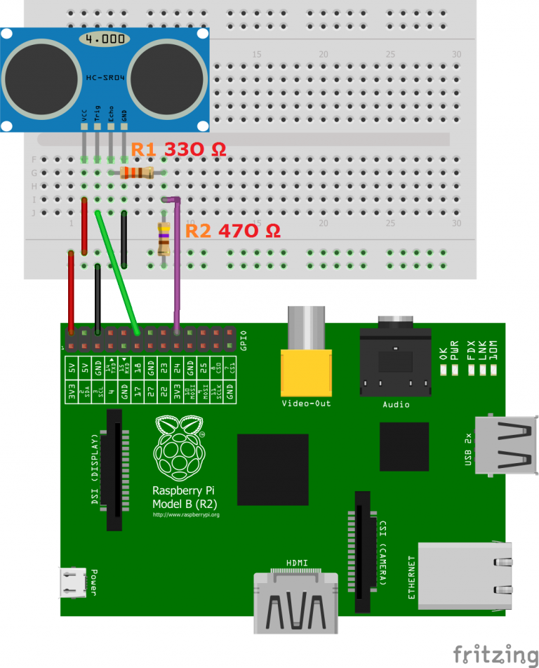

# Using a Raspberry Pi distance sensor (ultrasonic sensor HC-SR04)

## Hardware

- HC-SR04 Module
- Resistors: 330Ω and 470Ω
- Jumper wire

## Wiring

- VCC to Pin 2 (VCC)
- GND to Pin 6 (GND)
- TRIG to Pin 12 (GPIO18)
- connect the 330Ω resistor to ECHO. On its end you connect it to Pin 18 (GPIO24) and through a 470Ω resistor you connect it also to Pin6 (GND).

## Diagram for wiring



# Let's Measure the distance

## Follow below steps

### Copy the repository

```
git clone https://github.com/Pankaj-SinghR/IOT-Programs-Assignment.git
```

### Change directory

```
cd Ultrasonic-sensor
```

### Run the python file

```
python3 ultrasonic_distance.py
```
